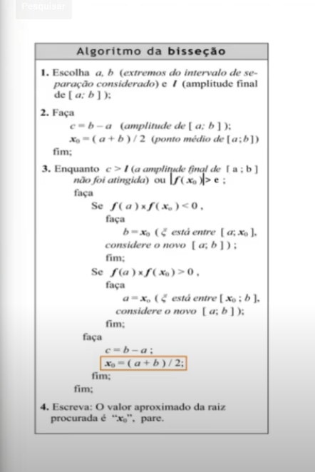

# Cálculo Numérico

Essa CCR envolve operações de adição, subtração, multiplicação, divisão, potenciação e radiciação, envolvendo os números reais. Entretanto o calculo numerico está diretamente ligado às expressões algébricas, envolvendo equações, inequações e sistemas de equações. Com esses fundamentos e instrumentos da matemática aplicada e computacional,  temos a finalidade de permitir a resolução de problemas da pesquisa científica e tecnológica, que podem ser representados e resolvidos numericamente, envolvendo modelagem e simulação, exemplificando e resolvendo problemas numéricos .

## Zero de Funções / Método da Bissecção

O Método da Bissecção converge sempre que a função f(x) for contínua no intervalo [a,b] e f(a)f(b) < 0. Entretanto, a convergência do Método da Bissecção é muito lenta, pois se o intervalo inicial é tal que (b0 – a0) >> ε e se ε for muito pequeno, o número de iterações tende a ser muito grande. Com isso temos o apoio da teoria da existencia da raíz no intervalo que nos ajuda no cálculo. 

Abaixo temos o fluxo de como funciona o codigo em python, com sequencia de passos e comentarios.

## Método das Cordas ou secante
